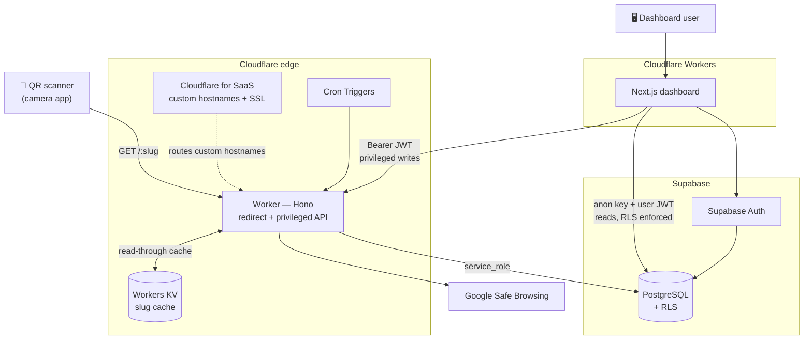
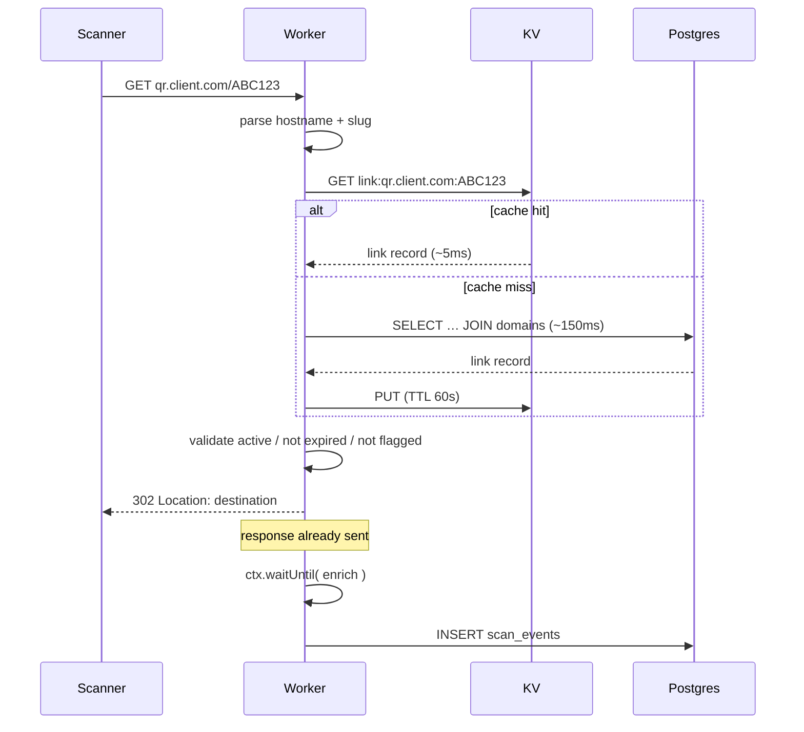
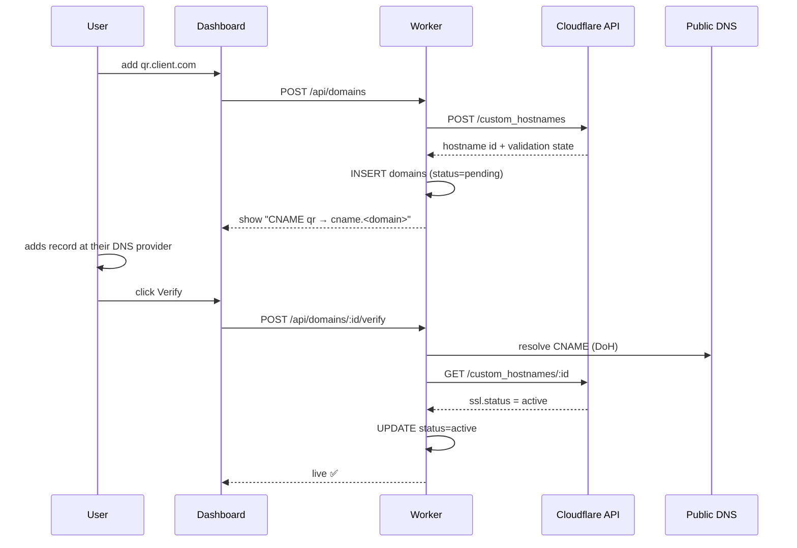

# QRly — Architecture

> Technical design: components, flows, schema, caching, and failure behaviour.
> Companion to `context.md`, which holds scope and product decisions. This document
> does not repeat those — it describes **how the system is built**.
>
> Last updated: 2026-08-29 · Status: **design only, nothing implemented**

---

## 1. System overview



### The central split

| Path | Goes to | Why |
|---|---|---|
| **Reads** — links list, analytics queries | Browser → Supabase directly | RLS already enforces ownership. No proxy layer needed, no code to write. |
| **Privileged writes** — link create/edit/delete, domain verification | Browser → Worker API | Needs the service_role key, the Cloudflare API, or KV invalidation. None of which may touch the browser. |
| **Redirects** | Scanner → Worker | Hot path. Must never traverse the dashboard. |

Link writes are routed through the Worker specifically so that Postgres and KV stay in
sync. If the dashboard wrote links straight to Supabase, the cache would silently serve
stale destinations.

---

## 2. Deployment topology

| Hostname | Serves | Runtime |
|---|---|---|
| `app.<domain>` | Next.js dashboard | Cloudflare Worker, built by the OpenNext adapter |
| `<domain>` | Redirect engine + `/api/*` | Cloudflare Worker |
| `qr.client.com` (× N) | Redirect engine only | Same Worker, via Cloudflare for SaaS |
| `*.workers.dev` | Everything, pre-domain | Same Worker |

Dashboard and redirect engine are on **separate hostnames** so no dashboard route can
ever collide with a slug. Sharing one hostname would make every path in the app a
permanently reserved word.

Until the domain is purchased, development runs entirely on `*.workers.dev`.

---

## 3. Component responsibilities

### Worker (`backend/`)
Single Worker, single Hono app. Two concerns behind one deployment:

1. **Redirect engine** — catch-all `GET /:slug`, registered last. Must stay lean: the
   module graph on this path pulls in KV, UA parsing, and geo extraction, nothing else.
2. **Privileged API** — `/api/*`, everything requiring the service_role key, the
   Cloudflare API, or cache invalidation.
3. **Scheduled handler** — cron work (section 10).

### Next.js dashboard (`frontend/`)
Renders UI, holds the Supabase session, queries Postgres directly for reads, calls the
Worker for privileged writes. Generates QR codes **client-side** — no server round trip,
no storage cost, instant preview.

### Workers KV
Read-through cache for slug resolution. Not a source of truth; safe to lose entirely.

### Supabase
Source of truth. Postgres with RLS on every table, plus Supabase Auth for identity.

---

## 4. Request flows

### 4.1 Redirect — the hot path



**Validation order**, cheapest checks first, all before the 302:

1. Hostname exists in `domains` and is `active` — rejects spoofed Host headers
2. Slug resolves to a link
3. `is_active = true`
4. `expires_at` is null or in the future
5. `safe_browsing_status != 'flagged'` — flagged links serve a warning page, **never a
   404**, because the printed QR must keep resolving

Any failure returns a branded 404 or warning page, not a redirect.

**Timing budget:**

| Stage | Target |
|---|---|
| KV hit → 302 | < 15 ms |
| KV miss → 302 | < 250 ms |
| p50 overall (warm cache) | < 20 ms |
| Analytics insert | after response, unbudgeted |

### 4.2 Link creation

```
Dashboard → POST /api/links (Bearer JWT)
  → Worker verifies JWT
  → validate destination: scheme allow-list, private-IP block, Safe Browsing
  → generate slug (or accept custom, check reserved words)
  → INSERT into links  [unique (domain_id, slug) catches collisions]
  → KV PUT link:{hostname}:{slug}
  → 201
```

Slug collisions are handled by the unique constraint, not by a pre-check — a
read-then-write would race. On conflict, regenerate and retry up to 3 times.

### 4.3 Cache invalidation

On every link update or delete, the Worker performs a **write-through**, not a delete:

```
UPDATE links … → KV PUT (new value)   // not KV DELETE
```

Writing the new value directly means a stale read during propagation returns the *old
destination*, not a cache miss storm against Postgres.

**Known constraint:** Workers KV is eventually consistent, up to roughly 60 seconds
globally. A destination edit can therefore serve the previous URL for up to a minute at
some edges. This is an accepted trade for the latency win, and **the dashboard must say
so** next to the edit form — silently stale redirects are the kind of thing that
destroys trust in a demo.

**Negative caching:** unknown slugs are cached as a `null` sentinel with a 30s TTL.
Without this, bot probes for random slugs hammer Postgres on every request.

### 4.4 Custom domain verification



DNS is checked over DNS-over-HTTPS from the Worker, independently of Cloudflare's own
validation, so the UI can distinguish *"you haven't added the record yet"* from *"record
found, certificate still issuing."* Those are very different messages to a confused user.

Full flow rationale and edge cases are in `context.md` §10.

---

## 5. Data architecture

### 5.1 Tables

```sql
-- extends auth.users
create table profiles (
  id             uuid primary key references auth.users(id) on delete cascade,
  email          text not null,
  display_name   text,
  retention_days integer not null default 365,
  created_at     timestamptz not null default now()
);

create table domains (
  id                    uuid primary key default gen_random_uuid(),
  user_id               uuid not null references auth.users(id) on delete cascade,
  hostname              text not null unique,
  is_custom             boolean not null default true,
  verification_status   text not null default 'pending',
      -- pending | verifying | active | failed
  cf_custom_hostname_id text,
  cname_target          text,
  ssl_status            text,
  dns_verified_at       timestamptz,
  created_at            timestamptz not null default now()
);

create table links (
  id                       uuid primary key default gen_random_uuid(),
  user_id                  uuid not null references auth.users(id) on delete cascade,
  domain_id                uuid not null references domains(id) on delete restrict,
  slug                     text not null,
  destination_url          text not null,
  title                    text,
  is_active                boolean not null default true,
  expires_at               timestamptz,
  safe_browsing_status     text not null default 'unchecked',
      -- unchecked | clean | flagged
  safe_browsing_checked_at timestamptz,
  created_at               timestamptz not null default now(),
  updated_at               timestamptz not null default now(),
  unique (domain_id, slug)
);

create table qr_codes (
  id               uuid primary key default gen_random_uuid(),
  user_id          uuid not null references auth.users(id) on delete cascade,
  link_id          uuid not null references links(id) on delete cascade,
  locked_domain_id uuid not null references domains(id) on delete restrict,
  style            jsonb not null default '{}',
  created_at       timestamptz not null default now()
);

create table daily_salts (
  day  date primary key,
  salt text not null
);
```

`domains` uses `on delete restrict` from `links` and `qr_codes` — deleting a domain that
still has printed QR codes pointing at it must be impossible.

### 5.2 `scan_events`

The wide table. Column groups map directly onto the dashboard sections.

```sql
create table scan_events (
  id              bigint generated always as identity primary key,
  link_id         uuid not null references links(id) on delete cascade,
  user_id         uuid not null references auth.users(id) on delete cascade,
  domain_id       uuid references domains(id) on delete set null,
  qr_id           uuid references qr_codes(id) on delete set null,
  event_type      text not null default 'redirect',   -- reserved; see context.md §8
  created_at      timestamptz not null default now(),

  -- geography (IP-derived, approximate — see context.md §6)
  country         text,
  region          text,
  region_code     text,
  city            text,
  postal_code     text,
  continent       text,
  latitude        numeric(9,6),   -- city centroid, NOT the user
  longitude       numeric(9,6),
  timezone        text,           -- IANA
  is_eu           boolean,

  -- network
  asn             integer,
  as_org          text,           -- ISP / carrier name
  colo            text,           -- Cloudflare datacenter (IATA)
  network_type    text,           -- mobile | broadband | corporate | datacenter | unknown
  tcp_rtt_ms      integer,
  http_protocol   text,
  tls_version     text,

  -- device
  device_type     text,           -- mobile | tablet | desktop | bot | unknown
  device_vendor   text,
  device_model    text,           -- Android only; null on iOS by design
  os_name         text,
  os_version      text,
  browser_name    text,
  browser_version text,
  ua_raw          text,

  -- locale
  language        text,
  languages       text[],

  -- acquisition
  referrer        text,
  referrer_host   text,
  utm_source      text,
  utm_medium      text,
  utm_campaign    text,
  utm_term        text,
  utm_content     text,

  -- derived in the scanner's own timezone
  local_hour      smallint,       -- 0–23
  local_dow       smallint,       -- 0–6

  -- identity and quality
  visitor_hash    text,           -- truncated sha256, daily-rotating salt
  is_first_scan   boolean,
  is_bot          boolean not null default false,
  bot_reason      text,
  gpc             boolean         -- Sec-GPC / DNT honoured
);
```

`user_id` is denormalised onto `scan_events` deliberately. Without it, every RLS check
and every dashboard aggregate would need a join back through `links`.

### 5.3 Indexes

```sql
create unique index on links (domain_id, slug);          -- every redirect hits this
create unique index on domains (hostname);
create index on scan_events (link_id, created_at desc);  -- link detail view
create index on scan_events (user_id, created_at desc);  -- account-wide dashboard
create index on scan_events (created_at);                -- retention purge sweep
create index on scan_events (user_id, country);          -- geo breakdown
create index on scan_events (user_id, utm_campaign)
  where utm_campaign is not null;                        -- partial: most rows are null
```

No partitioning and no rollup tables — see `context.md` §3 for why that is deliberate at
this scale.

### 5.4 RLS

Enabled on all tables. Every policy reduces to ownership:

```sql
alter table links enable row level security;

create policy "owner reads"  on links for select using (auth.uid() = user_id);
create policy "owner writes" on links for all    using (auth.uid() = user_id)
                                       with check (auth.uid() = user_id);

-- scan_events is read-only to users; the Worker inserts via service_role
alter table scan_events enable row level security;
create policy "owner reads scans" on scan_events for select using (auth.uid() = user_id);
```

The Worker's `service_role` key bypasses RLS entirely. **That key exists only in Worker
secrets.** It is never in a `NEXT_PUBLIC_*` variable, never in the client bundle, never
committed.

### 5.5 Aggregations

`supabase-js` cannot express `GROUP BY`. Dashboard aggregates are Postgres functions
called over RPC, declared `security invoker` so RLS still applies:

```sql
create function get_scan_summary(p_link_id uuid, p_from timestamptz, p_to timestamptz)
returns json language sql stable security invoker as $$ … $$;
```

Planned: `get_scan_summary`, `get_geo_breakdown`, `get_device_breakdown`,
`get_timeseries`, `get_utm_breakdown`, `get_local_time_heatmap`.

---

## 6. Caching architecture

| Key | Value | TTL |
|---|---|---|
| `link:{hostname}:{slug}` | link record + domain status | 60 min |
| `link:{hostname}:{slug}` | `null` sentinel (unknown slug) | 5 min |
| `hosts:active` | the set of servable hostnames | 5 min |
| `salt:{YYYY-MM-DD}` | daily visitor-hash salt | 48 h |

One cache read resolves the entire hot path. Domain validity is denormalised into the
cached link record, so a valid redirect never needs a second lookup.

**The TTLs were originally 60 s and 30 s. Both were wrong, for different reasons, and
`tools/check-ceilings.mjs` is what found it.**

Free-tier KV allows 100k reads/day but only **1k writes/day**. A cache fill is a write.
At a 60-second TTL a single continuously-scanned link refills 1,440 times a day and
exhausts the entire daily write budget on its own — one hot link, and the cache stops
working platform-wide.

The 60-second figure had conflated two unrelated things. Freshness after an edit comes
from the **write-through** in `routes/links.ts`, which pushes the new value the moment a
link changes; the TTL has nothing to do with it. The "~60 s" the dashboard quotes is
Workers KV's *global propagation* delay, a property of KV that no TTL affects. The TTL is
only a backstop for a row changed outside the Worker. At an hour, a hot link costs 24
writes a day and roughly forty can stay continuously hot.

The 30-second negative TTL was impossible regardless: KV refuses any `expirationTtl`
below 60.

**Negative caching is admitted on the second sighting, not the first.** A bot walking
random slugs would otherwise cost one KV write per probe, and a thousand probes is the
whole daily budget. Almost none of those slugs are ever requested twice, so caching the
first miss buys nothing. A genuinely mistyped code still gets cached, because people
retry. See `shouldCacheMiss` in `backend/src/lib/kv.ts`.

---

## 7. API surface

All `/api/*` routes require a Supabase JWT as `Authorization: Bearer`.

| Method | Route | Purpose |
|---|---|---|
| `POST` | `/api/links` | Create link, validate URL, seed cache |
| `PATCH` | `/api/links/:id` | Update destination, write through cache |
| `DELETE` | `/api/links/:id` | Delete link, purge cache |
| `POST` | `/api/domains` | Register custom hostname with Cloudflare |
| `POST` | `/api/domains/:id/verify` | DNS lookup + certificate status poll |
| `DELETE` | `/api/domains/:id` | Remove hostname (blocked if links exist) |
| `GET` | `/api/health` | Cron keep-alive target |
| `GET` | `/:slug` | **Redirect. Registered last.** |

Everything else — listing links, all analytics reads — goes browser → Supabase directly.

---

## 8. Auth architecture

```
Browser  ──login──▶  Supabase Auth  ──▶  JWT (access + refresh)
   │
   ├─▶ Supabase Postgres   : anon key + JWT   → RLS enforced
   └─▶ Worker /api/*       : Bearer JWT       → verified, then service_role used
```

The Worker verifies the JWT itself rather than round-tripping to Supabase on every
request. **Open question for phase 1:** newer Supabase projects sign with asymmetric
keys (ES256, verified via JWKS) while older ones use a shared HS256 secret. Which
applies to project `qragyngjqlizazdkaowa` must be confirmed before the auth middleware
is written.

---

## 9. Analytics pipeline

```
302 sent
   ↓
ctx.waitUntil( … )
   ↓
extract request.cf        → geo + network fields
parse user-agent          → device / OS / browser
parse Accept-Language     → locale
parse query string        → UTM
classify ASN              → network_type; datacenter ⇒ bot
detect bot                → UA patterns + Sec-Fetch-* + known preview fetchers
derive local_hour/dow     → from cf.timezone
compute visitor_hash      → sha256(daily_salt + ip + ua + link_id), truncated
   ↓
INSERT scan_events
```

The raw IP exists only inside this function's scope and is never written anywhere. The
daily salt rotation makes the hash irreversible and self-expiring — see `context.md` §11.

`is_first_scan` is resolved by a conditional insert against `visitor_hash`, avoiding a
read-before-write.

---

## 10. Scheduled jobs

| Schedule | Job |
|---|---|
| Daily 00:00 UTC | Rotate `daily_salts`, seed the new day's salt |
| Daily | Ping Supabase to prevent 7-day free-tier auto-pause (`context.md` §9) |
| Daily | Purge `scan_events` older than each account's `retention_days` |
| Weekly | Re-check destinations against Safe Browsing; flag regressions |

---

## 11. Security layers

| Threat | Mitigation |
|---|---|
| Spoofed `Host` header | Hostname resolved against `domains`, rejected unless `active`. Cloudflare for SaaS only routes hostnames we registered. |
| Open redirect | Scheme allow-list `http`/`https`/`mailto`/`tel`/`sms`. `javascript:`, `data:`, `vbscript:` blocked. |
| SSRF via destination | Private, loopback, and link-local IP ranges blocked at create time. |
| Malicious destinations | Safe Browsing on create + weekly. Flagged links serve a warning page, preserving the printed QR. |
| Credential leak | `service_role` only in Worker secrets. Browser only ever holds the `anon` key. |
| Cross-tenant data access | RLS on every table, keyed on `auth.uid()`. |
| Scan flooding | Per-client-and-slug rate limits on redirects, per-account on writes. **Per-isolate, not global** — a correct global limiter needs Durable Objects, which require Workers Paid. See `backend/src/lib/rate-limit.ts`. |
| Bot inflation | Preview fetchers recorded but flagged, excluded from headline metrics by default. |
| Cache poisoning | KV written only by the Worker, never from user input directly. |
| KV write-quota exhaustion | Hostnames resolved against `domains` before any negative-cache write, so a spoofed-`Host` flood writes nothing; unknown slugs cached only on a second sighting, so a namespace walk writes nothing. |

---

## 12. Failure modes

| Failure | Behaviour |
|---|---|
| **Supabase down, cache warm** | Redirects keep working from KV. Analytics writes dropped silently. This is the single most valuable resilience property in the design. |
| **Supabase down, cache cold** | 503 with a branded page. |
| **KV down** | Falls through to Postgres. Slower, still correct. |
| **Analytics insert fails** | Swallowed. The 302 was already sent; a scan is never blocked by telemetry. |
| **Cloudflare API down** | Domain verification stays `pending` and retries. Existing redirects unaffected. |
| **Safe Browsing down** | Link created as `unchecked`, resolved by the weekly sweep. |
| **Supabase 500 MB cap reached** | Postgres goes read-only. Redirects survive on cache; analytics stop. Retention purge is the guard. |

The consistent principle: **a redirect must survive the failure of everything except
Cloudflare.**

Every row above is exercised in `backend/test/failure-modes.test.ts`, with Supabase
simulated as down by pointing `SUPABASE_URL` at a host that does not resolve — the real
`fetch` failure path, not a mock at a convenient seam. That suite found a genuine defect:
a KV **read** failure propagated as an unhandled 500 rather than falling through to
Postgres, so the "KV down → slower, still correct" row was not true until it was fixed.

---

## 13. Repository layout

```
QRly/
├── context.md
├── architecture.md
├── .env                       # local only, gitignored
├── supabase.md                # local only, gitignored
│
├── backend/                   # Cloudflare Worker
│   ├── src/
│   │   ├── index.ts           # Hono app, route registration, cron handler
│   │   ├── routes/
│   │   │   ├── redirect.ts    # catch-all /:slug — keep lean
│   │   │   ├── links.ts
│   │   │   ├── domains.ts
│   │   │   └── health.ts
│   │   ├── lib/
│   │   │   ├── supabase.ts    # service_role client
│   │   │   ├── kv.ts          # read-through cache, write-through invalidation
│   │   │   ├── auth.ts        # JWT verification middleware
│   │   │   ├── analytics.ts   # event enrichment + insert
│   │   │   ├── ua.ts          # user-agent parsing
│   │   │   ├── geo.ts         # request.cf extraction
│   │   │   ├── bot.ts         # bot + preview-fetcher detection
│   │   │   ├── asn.ts         # ASN → network_type classification
│   │   │   ├── url-safety.ts  # scheme allow-list, private IP, Safe Browsing
│   │   │   ├── hash.ts        # visitor hash + daily salt
│   │   │   └── cloudflare.ts  # custom hostname API client
│   │   └── types.ts
│   ├── wrangler.toml
│   └── package.json
│
├── frontend/                  # Next.js dashboard
│   ├── src/
│   │   ├── app/
│   │   │   ├── (auth)/        # login, signup
│   │   │   └── (dashboard)/   # links, qr, domains, analytics, settings
│   │   ├── components/
│   │   │   ├── charts/
│   │   │   ├── qr/            # client-side QR generation + preview
│   │   │   └── ui/
│   │   └── lib/
│   │       ├── supabase/      # browser + server clients
│   │       ├── api.ts         # Worker API client
│   │       └── queries.ts     # analytics RPC wrappers
│   ├── next.config.ts
│   └── package.json
│
└── supabase/
    └── migrations/            # SQL migrations
```

`backend/src/types.ts` is the canonical type source; the frontend imports it by relative
path. A shared workspace package would be cleaner but is not worth the tooling overhead
at this size.

---

## 14. Environment and secrets

| Variable | Where | Exposed to browser |
|---|---|---|
| `SUPABASE_URL` | both | ✅ yes |
| `SUPABASE_ANON_KEY` | both | ✅ yes — safe, RLS-backed |
| `SUPABASE_SERVICE_KEY` | Worker secret | ❌ **never** |
| `SUPABASE_JWT_SECRET` / JWKS URL | Worker secret | ❌ never |
| `CLOUDFLARE_API_TOKEN` | Worker secret | ❌ never |
| `CLOUDFLARE_ZONE_ID` | Worker secret | ❌ never |
| `SAFE_BROWSING_API_KEY` | Worker secret | ❌ never |
| `VISITOR_HASH_PEPPER` | Worker secret | ❌ never |

Worker secrets are set with `wrangler secret put` and live in Cloudflare, not in
`wrangler.toml`. Only variables prefixed `NEXT_PUBLIC_` reach the client bundle, and
only the first two above may ever carry that prefix.

---

## 15. Open design questions

1. ~~**Supabase JWT signing method**~~ — **resolved: ES256 via JWKS.** The endpoint at
   `/auth/v1/.well-known/jwks.json` serves an EC P-256 key, and real user tokens carry
   `alg: ES256` with a `kid`. The Worker verifies with `jose` against a cached remote
   JWKS. Note the *legacy API keys* (`anon`, `service_role`) are still HS256 JWTs — they
   are API keys, not user tokens, and must not be run through the same verifier.
2. ~~**Postgres connection method**~~ — **resolved: the session pooler is required.**
   `db.qragyngjqlizazdkaowa.supabase.co` resolves to an AAAA record only and is
   unreachable from an IPv4 host. Migrations run against
   `aws-0-ap-northeast-1.pooler.supabase.com:5432` as `postgres.<ref>`. The password
   contains a literal `@` and must be percent-encoded as `%40` in the URI. The pooler
   also does not support prepared statements, so the client sets `prepare: false`.
3. ~~**Next.js deploy target**~~ — **resolved: `@opennextjs/cloudflare`.** Configured in
   `frontend/open-next.config.ts` and `frontend/wrangler.jsonc`.
4. ~~**Map rendering library**~~ — **resolved: no library.** Natural Earth's 110m country
   topology (public domain, 105 KB) is served from `frontend/public/geo/`, projected with
   `d3-geo` and drawn as inline SVG. No tile server, no API key, nothing metered, and it
   works offline. The geometry is fetched at render time rather than imported, so it never
   enters the bundle for anyone who does not open the analytics page.

   The topology keys countries by ISO 3166-1 *numeric* id while Cloudflare reports
   *alpha-2*, so `tools/build-country-codes.mjs` generates the mapping and commits it.
   That script carries a deny list of withdrawn codes: CLDR resolves `UK` and `GB` to the
   same display name, and the first version of the map silently lost the United Kingdom
   because of it.
